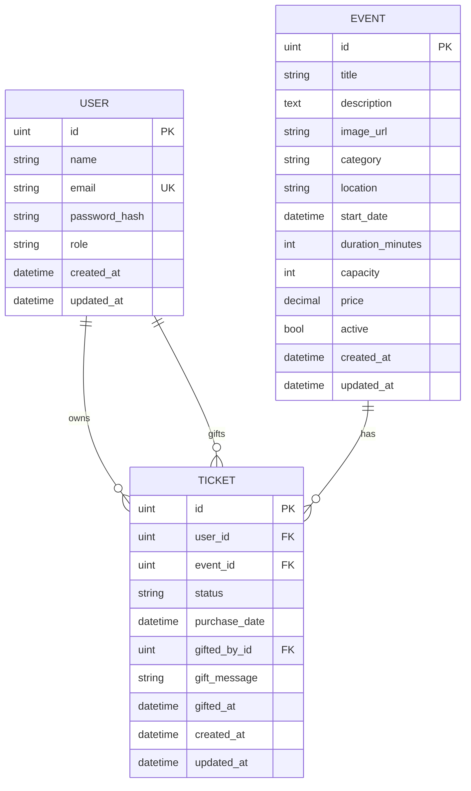

# TicketApp

TicketApp es un sistema web de gestión de eventos y entradas tipo Ticketek, desarrollado para la materia Desarrollo de Software 2026. La aplicación permite publicar eventos, comprar entradas, administrar cupos, cancelar o transferir tickets y consultar reportes administrativos.

## Descripción del sistema

El sistema está dividido en tres capas principales:

- **Backend API REST:** expone endpoints públicos, autenticación JWT, operaciones de cliente y operaciones administrativas.
- **Frontend web:** ofrece la experiencia de usuario para clientes y administradores desde una interfaz React.
- **Base de datos:** persiste usuarios, eventos y tickets, incluyendo cancelaciones, transferencias y regalos.

La documentación complementaria se encuentra en `docs/`:

- [`docs/API.md`](docs/API.md): contrato de endpoints.
- [`docs/DATABASE.md`](docs/DATABASE.md): modelo de datos.
- [`docs/FRONTEND.md`](docs/FRONTEND.md): vistas y lineamientos del frontend.
- [`docs/TESTING.md`](docs/TESTING.md): estrategia y comandos de testing.
- [`docs/LOCAL_SETUP.md`](docs/LOCAL_SETUP.md): guía de setup local.

## Tecnologías utilizadas

### Backend

- Go
- Gin
- GORM
- MySQL
- JWT
- bcrypt

### Frontend

- React
- Vite
- Tailwind CSS
- CSS

### DevOps

- Docker
- Docker Compose
- Nginx

### Testing

- Go testing
- `httptest`
- SQLite in-memory

## Requisitos previos

Para ejecución local sin Docker:

- Go instalado.
- Node.js y npm instalados.
- MySQL disponible localmente.
- Variables de entorno del backend configuradas según `backend/.env.example`.

Para ejecución con Docker:

- Docker.
- Docker Compose.

## Instalación y uso local

### Backend

```bash
cd backend
go mod tidy
go run main.go
```

Al iniciar, el backend conecta con MySQL usando las variables de entorno configuradas, crea la base `ticketapp` si no existe, ejecuta las migraciones GORM de `User`, `Event` y `Ticket`, y carga datos demo idempotentes.

Variables JWT principales:

```env
JWT_SECRET=super-secret-dev-key
JWT_EXPIRATION_HOURS=24
```

> `JWT_SECRET` debe cambiarse antes de usar el sistema fuera de un entorno de desarrollo.

### Frontend

```bash
cd frontend
npm install
npm run dev
```

La aplicación frontend queda disponible en la URL indicada por Vite, normalmente `http://localhost:5173`.

## Ejecución con Docker Compose

Desde la raíz del repositorio:

```bash
docker compose up --build
```

Este comando levanta MySQL, el backend Go/Gin y el frontend React/Vite servido con Nginx. No hace falta tener MySQL instalado localmente para usar Docker.

### URLs y puertos

- Frontend: `http://localhost:5173`
- Backend health: `http://localhost:8080/api/health`
- MySQL desde el host: `localhost:3307`
- MySQL dentro de Docker: `mysql:3306`

Docker expone MySQL en el puerto `3307` del host para evitar conflictos si ya existe un MySQL local en `3306`. Dentro de la red de Docker, el backend se conecta a `mysql:3306`.

### Comandos Docker útiles

```bash
docker compose down
docker compose down -v
docker compose logs -f backend
docker compose logs -f frontend
docker compose logs -f mysql
```

`docker compose down -v` borra el volumen local de MySQL del contenedor y resetea la base de datos. Al iniciar nuevamente, el backend migra y siembra datos demo reproducibles.

## Credenciales demo

- Admin: `admin@test.com` / `123456`
- Cliente: `octavio@test.com` / `123456`
- Cliente: `lorenzo@test.com` / `123456`
- Cliente: `pablo@test.com` / `123456`

## Funcionalidades Cliente

- **Catálogo:** listado público de eventos activos, con filtros de búsqueda, categoría y disponibilidad.
- **Detalle:** información completa de un evento, precio, ubicación, fecha y cupo disponible.
- **Compra:** emisión de una entrada activa para el usuario autenticado si existe disponibilidad.
- **Mis entradas:** listado de tickets propios con estado, evento, fecha, precio y datos de regalo si corresponde.
- **Cancelación:** baja de una entrada propia cambiando su estado a `CANCELLED`.
- **Transferencia:** cambio de titularidad de una entrada activa existente hacia otro usuario registrado.

## Funcionalidades Admin

- **Gestión de eventos:** panel para listar eventos activos e inactivos con ventas y cupos.
- **Creación:** alta de eventos con título, descripción, categoría, ubicación, fecha, duración, capacidad, precio e imagen.
- **Edición:** actualización parcial de los datos del evento, respetando validaciones de capacidad y categoría.
- **Baja lógica:** deshabilitación de eventos mediante `active=false`, sin borrar registros físicos.
- **Reportes y métricas:** estadísticas generales y por evento, incluyendo tickets activos, cancelados, capacidad, ocupación e ingresos estimados.

## Bonus Track: Regalar entrada

TicketApp incluye el flujo **Regalar entrada**. Desde el detalle de un evento, un cliente autenticado puede emitir una entrada nueva a nombre de otro usuario registrado, con un mensaje opcional.

La diferencia con transferencia es intencional:

- **Regalar entrada:** crea/emite un ticket nuevo para otro usuario.
- **Transferir entrada:** mueve un ticket existente desde el dueño actual hacia otro usuario.

## Diagrama de Base de Datos



## Decisiones de diseño

- Los eventos no se borran físicamente: se realiza baja lógica con `active=false`.
- Los tickets se cancelan cambiando `status` a `CANCELLED`.
- La disponibilidad se calcula solo con tickets `ACTIVE`.
- El JWT incluye `user_id`, `email` y `role`.
- Las rutas admin están protegidas con `AuthMiddleware` + `AdminMiddleware`.
- Regalar entrada crea un ticket nuevo para otro usuario.
- Los tests usan SQLite in-memory para no depender de MySQL ni Docker.

## Testing backend

Los tests automatizados del backend usan SQLite in-memory mediante helpers de GORM. No requieren MySQL ni Docker. El archivo `coverage.out` se genera localmente para analizar cobertura y no debe commitearse.

Cobertura final validada localmente: **84.2%**.

```bash
cd backend
go test ./...
go test ./... -cover
go test ./tests "-coverpkg=github.com/OctiDelFabro/ticketapp/backend/controllers,github.com/OctiDelFabro/ticketapp/backend/services,github.com/OctiDelFabro/ticketapp/backend/dao,github.com/OctiDelFabro/ticketapp/backend/routes,github.com/OctiDelFabro/ticketapp/backend/middlewares,github.com/OctiDelFabro/ticketapp/backend/utils" "-coverprofile=coverage.out"
go tool cover "-func=coverage.out"
```
