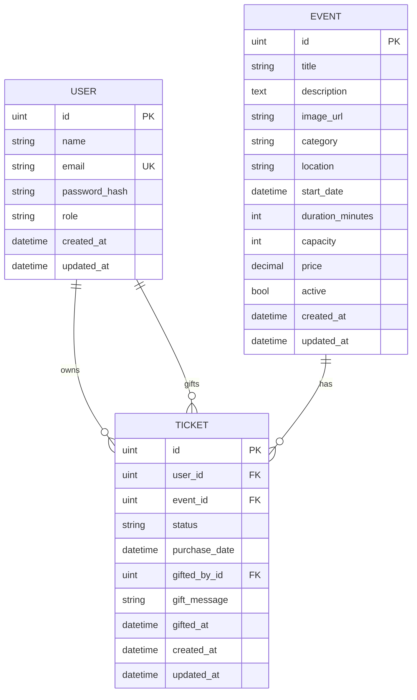

# Modelo de Base de Datos

TicketApp persiste tres entidades principales: `User`, `Event` y `Ticket`. El modelo soporta compra, cancelación, transferencia y regalo de entradas.

## User

Representa una cuenta del sistema.

| Campo | Descripción |
| --- | --- |
| `id` | Identificador primario. |
| `name` | Nombre visible del usuario. |
| `email` | Email único usado para login y búsqueda de destinatarios. |
| `password_hash` | Contraseña hasheada con bcrypt. |
| `role` | Rol del usuario: `CLIENT` o `ADMIN`. |
| `created_at` | Fecha de creación. |
| `updated_at` | Fecha de última actualización. |

## Event

Representa un evento vendible en el catálogo.

| Campo | Descripción |
| --- | --- |
| `id` | Identificador primario. |
| `title` | Título del evento. |
| `description` | Descripción del evento. |
| `image_url` | URL de imagen usada por el frontend. |
| `category` | Categoría del evento. |
| `location` | Ubicación del evento. |
| `start_date` | Fecha y hora de inicio. |
| `duration_minutes` | Duración estimada en minutos. |
| `capacity` | Capacidad total disponible. |
| `price` | Valor de entrada general en ARS, `not null`, default `0`. |
| `active` | Indica si el evento está publicado. Se usa para baja lógica. |
| `created_at` | Fecha de creación. |
| `updated_at` | Fecha de última actualización. |

## Ticket

Representa una entrada emitida para un evento.

| Campo | Descripción |
| --- | --- |
| `id` | Identificador primario. |
| `user_id` | FK obligatoria hacia `User`. Indica el dueño actual del ticket. |
| `event_id` | FK obligatoria hacia `Event`. Indica el evento al que pertenece la entrada. |
| `status` | Estado del ticket, por ejemplo `ACTIVE` o `CANCELLED`. |
| `purchase_date` | Fecha de emisión/compra de la entrada. |
| `gifted_by_id` | FK opcional hacia `User`. Indica qué usuario regaló la entrada. |
| `gift_message` | Mensaje opcional del regalo. |
| `gifted_at` | Fecha en la que se emitió la entrada como regalo. |
| `created_at` | Fecha de creación. |
| `updated_at` | Fecha de última actualización. |

## Relaciones

- Un `User` puede tener muchos `Ticket` mediante `tickets.user_id`.
- Un `User` puede haber regalado muchos `Ticket` mediante `tickets.gifted_by_id`.
- Un `Event` puede tener muchos `Ticket` mediante `tickets.event_id`.
- Un `Ticket` pertenece a un único `Event`.
- Un `Ticket` pertenece a un usuario dueño actual mediante `user_id`.
- `gifted_by_id` es opcional: solo se completa cuando el ticket fue creado desde el flujo **Regalar entrada**.

## Diagrama

